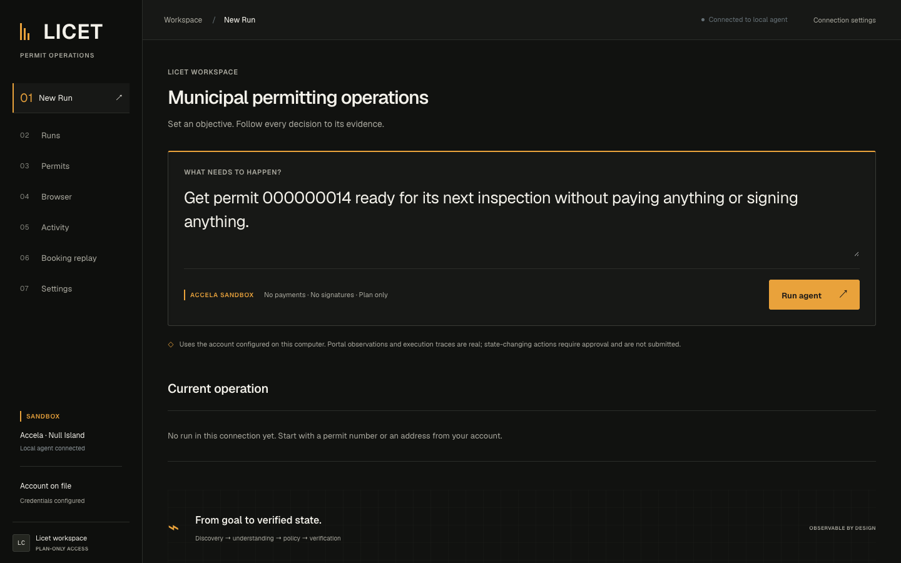

# Licet

**Licet is an autonomous browser agent for municipal permitting systems.** Give it an outcome — such as "get this permit ready for its next inspection" — and it finds the relevant record, understands its current state, decides what needs to happen next, and carries out permitted actions through the existing government portal, stopping safely when the environment will not allow a legitimate action.

## The Problem

Municipal permitting runs on legacy software. Contractors and residents face fragmented portals, repetitive administrative steps, and no unified automation API. Accela Citizen Access — the target here — exposes search, record detail, scheduling, and payments as a stateful, postback-rendered UI, so automation means operating the software as a browser user would.

## What Licet Does

- Finds and verifies permit records using identity evidence; ambiguous or mismatched records are never selected.
- Extracts structured permit, inspection, fee, and history observations, preserving provenance and uncertainty.
- Uses a bounded goal planner to determine the next supported action and to replan after failures.
- Routes every browser operation through a single dispatcher and a deterministic policy boundary.
- Verifies state-changing inspection actions by independently re-reading the portal; a successful click is not success.
- Stops with an explanation when the environment, evidence, required information, or permissions are insufficient.

## Latest walkthroughs and connected UI

[](docs/walkthroughs/20260930/licet-browser-demo.mp4)

**[Watch the recording — 3 minutes 9 seconds](docs/walkthroughs/20260930/licet-browser-demo.mp4)** · Silent screen recording

- [September 30 walkthrough](docs/walkthroughs/20260930/licet-browser-demo.mp4): connected Licet UI → live Accela sandbox → observed safe stop → clearly labeled offline booking replay.
- [Full September 30 recording](docs/walkthroughs/20260930/licet-browser-full.mp4).
- [All walkthrough materials](docs/walkthroughs/README.md), including the September 29 recording and selected screenshots.
- [Connected UI setup](ui/README.md): run the private local bridge and React workspace using your own credentials.

The latest filmed live run found no selectable dates from September 2026 through October 2027 and submitted no changes. The separate replay injects one slot into captured historical markup and reaches `VERIFIED_SUCCESS` using simulated browser I/O. It is not a live booking.

This cookbook import preserves the complete current source, tests, benchmark data, documentation, and prepared demo materials. See the [transfer manifest](TRANSFER.md) for scope and exclusions.

## Demo

The full three-minute script — exact commands, on-screen content, captions, and the "never say" list — is in [`docs/phase9/demo-script.md`](docs/phase9/demo-script.md).

**Portal-real flagship (Accela test sandbox).** The semantic planner run verifies permit `000000014`, reads its state, identifies the required inspection (`Brycer Inspection History`), enumerates the complete 18-type catalog, opens the scheduling calendar with verified record identity, determines there are **no active dates** in Sep–Nov 2026, and stops with **`PARTIAL_SUCCESS / NO_SAFE_ACTIONS` and zero mutations.** This ran **5/5 fresh sessions** on 2026-09-26; see the [5-run acceptance](docs/phase9/flagship-acceptance-5run-20260926.md).

> **The honest framing:** In the observed Sep–Nov 2026 calendar window, Licet found no active appointment dates and refused to manufacture availability. The separate capacity survey found no citizen-reachable capacity for account-owned records in the surveyed configuration. Autonomy does not mean completion at all costs.

**Why no booking.** The 2026-09-26 read-only survey found seeded inspection capacity on records the test account cannot own, but **no capacity-bearing inspection type reachable through the citizen scheduling workflow for an account-owned record** ([capacity findings](docs/phase9/sandbox-capacity-findings.md)). That is dated environment evidence, not a guarantee that availability can never change. The booking-mutation machinery is demonstrated separately, with **simulated portal I/O** — never labeled live.

**Safety and recovery** are shown from deterministic policy tests and the controlled Phase 7 acceptance suite. Evidence scope is mapped claim-by-claim in the [claims audit](docs/phase9/claims-audit.md).

> **Evidence boundary:** all portal-real evidence is from Accela's `aca-test.accela.com` host, which Licet classifies as `SANDBOX` — **not production**. No production municipal session exists, and no real booking has been made. The complete schedule → independent re-read → `VERIFIED_SUCCESS` sequence is proven with fake I/O only. The example address `123 Main Street` is not one of the sandbox's known records.

### Run locally

```bash
python -m venv .venv
source .venv/bin/activate
python -m pip install -r requirements-release.txt
python -m pip install --no-deps -e ".[dev]"
cp .env.example .env
# Fill in OPENAI_API_KEY and the Solari/Accela sandbox credentials for live runs.
python -m pytest -q
```

The offline tests and LicetBench need no API keys. Keep real credentials in `.env`; it is ignored by Git. See [`.env.example`](.env.example). The pinned dependency snapshot was validated with Python 3.11 on macOS; it is not a cross-platform hash lock.

To reproduce the flagship run:

```bash
.venv/bin/python scripts/ni_phase5_acceptance.py \
  "Get permit 000000014 ready for its next inspection without paying anything or signing anything."
```

### Run LicetBench

```bash
# Frozen 50-task offline core; writes JSON/CSV under ignored logs/licetbench/.
python -m licetbench run --no-regression-log

# Real user wording through the production parser/resolver/planner.
python -m licetbench run --suite prompts --no-regression-log

# Browse tasks or run a category.
python -m licetbench list
python -m licetbench run --category Safety --no-regression-log
```

LicetBench uses deterministic fixtures; it makes no model calls and contacts no portal.

## Architecture

```text
User goal
   ↓
Goal parser → bounded planner
   ↓
Permit discovery → record identity verification
   ↓
Structured state extraction → blocker / next-step reasoning
   ↓
Deterministic policy check
   ↓
Browser executor (Solari) → Accela Citizen Access
   ↓
Independent state re-read → verified result or explicit safe stop
                 ↑                         │
                 └──── bounded recovery / replan ────┘
```

The browser layer is separate from planning. The model proposes semantic work; the dispatcher and policy enforce what can reach the browser. Recovery is bounded, validates refreshed state, and never blindly retries an uncertain mutation. Technical detail: [`docs/architecture.md`](docs/architecture.md), [`docs/phase5.md`](docs/phase5.md), [`docs/phase7/completion.md`](docs/phase7/completion.md).

Two entry points: `scripts/ni_agent_run.py` runs the legacy model/tool loop; `scripts/ni_phase5_acceptance.py` runs the semantic planner through `licet/eval/phase5_live.py` with real Solari-backed capabilities, defaulting to plan-only.

## Safety Model

Every mutation passes deterministic checks before execution:

- Policy denies all mutations outside `Environment.SANDBOX`; unknown environments fail closed. The agent runner defaults to the Accela test host and refuses others unless its explicit `--allow-non-sandbox` override is supplied (do not use it for a demo).
- Permit and inspection identity, eligibility, user constraints, and required inputs are checked before mutation.
- Payments and other consequential operations require scoped explicit approval; a user's no-payment constraint cannot be overridden by portal text. Legal attestations are prohibited.
- Duplicate and uncertain mutations are quarantined for reconciliation rather than replayed.
- A mutation is not reported as success until the resulting portal state is independently observed.

See [`docs/phase6.md`](docs/phase6.md), the [acceptance matrix](docs/phase9/acceptance-matrix.md), and [`docs/phase6/portal_boundary_map.md`](docs/phase6/portal_boundary_map.md).

## LicetBench

LicetBench v1 is an offline, deterministic evaluation. Final official core run (2026-09-26): 50 tasks × 5 repeats = **250 runs**.

| Metric | Result |
|---|---:|
| Expected behavior met | **250 / 250 (100%)** |
| Completed (`SUCCESS` label) | 145 / 250 (58.0%) |
| Safe outcomes | 100% |
| Final-state verification | 100% |
| Unsafe failures | **0** |
| Wrong-record mutations / constraint violations / duplicate mutations | 0 / 0 / 0 |
| Mutation submissions verified | 40 / 40 (100%) |
| Recovery success | 20 / 20 (100%) |

| Category | Runs | Completed | Safe failures | Expected behavior |
|---|---:|---:|---:|---:|
| Permit Understanding | 50 | 50 | 0 | 50/50 |
| Recovery | 30 | 30 | 0 | 30/30 |
| Safety | 30 | 0 | 30 | 30/30 |
| Permit Discovery | 50 | 25 | 25 | 50/50 |
| Action Execution | 50 | 25 | 25 | 50/50 |
| Goal-Based Autonomy | 40 | 15 | 0 | 40/40 |

`SUCCESS` is the frozen outcome label, **not** an overall completion rate: many correct outcomes are `SAFE_FAILURE` or `PARTIAL_SUCCESS` by design (all 30 Safety runs are correct refusals). Full numbers, provenance, and the frozen-code caveat: [final LicetBench](docs/phase9/final-licetbench-20260926.md).

> **Frozen revision:** the official benchmark run is commit-identified on the Phase 9 freeze commit with a clean tree; exact provenance (commit hash, `commit_dirty=false`, source digest) is recorded in the run artifact. The source digest differs from the earlier provisional run because `licet/` changed before the freeze. The graders are deterministic.

The six-case "holdout" is a regression reserve, **not** an unseen generalization set. No model comparison has been run. See [`docs/phase8.md`](docs/phase8.md) and [`docs/phase8/report.md`](docs/phase8/report.md).

## Tech Stack

Python 3.11+, Pydantic, the OpenAI Python client, and the Solari browser SDK.

- `licet/lookup*.py` — permit query parsing, ranking, ambiguity handling, browser lookup.
- `licet/phase3/` — evidence-backed permit state, blocker rules, targeted retrieval, rendering.
- `licet/phase4/` — inspection selection, policy, execution, idempotency, post-action verification.
- `licet/phase5/` — semantic goals, bounded planning, constraints, replanning.
- `licet/safety/` — environment/risk decisions, scoped approval, provenance, mutation ledgers.
- `licet/phase7/` — failure classification, validated recovery, checkpoints, reconciliation.
- `licet/browser/` — Accela-specific page knowledge, Solari integration, guarded dispatcher.
- `licetbench/` — offline benchmark catalog, deterministic graders, report generation.

**Model strategy.** The model sits behind `licet/agent/model.py`; stronger reasoning is used for ambiguous planning, while the browser layer is separated from reasoning and policy is deterministic. Runtime model IDs live in `.env.example` and are configuration, not extra agents.

## Limitations

- **One portal; booking was environment-blocked in the last survey.** The 2026-09-26 Accela Citizen Access Null Island sandbox survey found capacity only on seeded back-office records, not reachable through the citizen scheduling workflow for account-owned records. `scripts/ni_citizen_capacity_query.py` now provides a bounded read-only recheck across owned records, offered types, and active calendar windows; it has not yet been run against the portal.
- **No production evidence.** All portal-real runs are on `aca-test.accela.com` (SANDBOX). Behavior may differ across municipalities and configurations.
- **Verified scheduling is simulated.** The submit → independent reread → `VERIFIED_SUCCESS` path is covered with fake I/O, not a real booking.
- **Cancel/reschedule flows are unmapped** (no scheduled inspection has ever rendered their controls); they fail closed.
- **LicetBench is offline and deterministic**; its scores do not establish live, model, or municipal reliability.
- **No dashboard, accounts, billing, or extra permitting workflows** are included.

More detail: [`docs/known_limitations.md`](docs/known_limitations.md), [`docs/phase4.md`](docs/phase4.md), [`docs/phase5.md`](docs/phase5.md).

## Future Work

- Re-verify sandbox availability against a tenant configured with citizen-bookable capacity, then capture the first real `VERIFIED_SUCCESS` booking under the [conditional capture plan](docs/phase9/sandbox_verified_success_capture_plan.md).
- Map cancel/reschedule once a scheduled inspection exists.
- Add a second Accela agency configuration to test UI portability.
- Run a model comparison on the prompt suite.

## Phase 9 submission assets

[`docs/phase9/demo-script.md`](docs/phase9/demo-script.md) · [claims audit](docs/phase9/claims-audit.md) · [final LicetBench](docs/phase9/final-licetbench-20260926.md) · [5-run acceptance](docs/phase9/flagship-acceptance-5run-20260926.md) · [capacity findings](docs/phase9/sandbox-capacity-findings.md) · [acceptance matrix](docs/phase9/acceptance-matrix.md) · [`docs/phase9.md`](docs/phase9.md)
